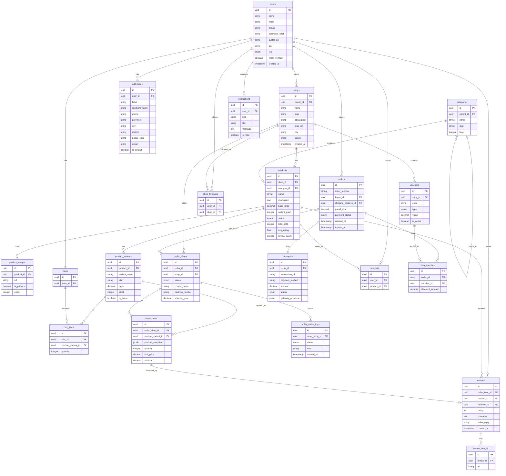

# Entity Relationship Diagram (ERD)
## BeliBeli — Multi-Seller Marketplace

**Versi:** 1.0  
**Tanggal:** 4 Mei 2026  

---

## 1. Daftar Entitas & Atribut

### `users`
| Kolom | Tipe | Keterangan |
|-------|------|-----------|
| id | UUID PK | Primary key |
| name | VARCHAR(100) | Nama lengkap |
| email | VARCHAR(255) UNIQUE | Email (untuk login) |
| phone | VARCHAR(20) | Nomor HP |
| password_hash | VARCHAR(255) | Hash bcrypt |
| avatar_url | TEXT | URL foto profil |
| bio | TEXT | Bio singkat |
| role | ENUM | `buyer` \| `seller` \| `admin` |
| email_verified | BOOLEAN | Status verifikasi email |
| created_at | TIMESTAMP | Waktu dibuat |
| updated_at | TIMESTAMP | Waktu diperbarui |

### `shops`
| Kolom | Tipe | Keterangan |
|-------|------|-----------|
| id | UUID PK | |
| owner_id | UUID FK → users | Pemilik toko |
| name | VARCHAR(100) UNIQUE | Nama toko |
| slug | VARCHAR(120) UNIQUE | URL-friendly name |
| description | TEXT | Deskripsi toko |
| logo_url | TEXT | URL logo toko |
| banner_url | TEXT | URL banner toko |
| city | VARCHAR(100) | Kota lokasi toko |
| status | ENUM | `active` \| `suspended` \| `closed` |
| created_at | TIMESTAMP | |
| updated_at | TIMESTAMP | |

### `addresses`
| Kolom | Tipe | Keterangan |
|-------|------|-----------|
| id | UUID PK | |
| user_id | UUID FK → users | Pemilik alamat |
| label | VARCHAR(50) | Contoh: "Rumah", "Kantor" |
| recipient_name | VARCHAR(100) | Nama penerima |
| phone | VARCHAR(20) | No. HP penerima |
| province | VARCHAR(100) | Provinsi |
| city | VARCHAR(100) | Kota/Kabupaten |
| district | VARCHAR(100) | Kecamatan |
| postal_code | VARCHAR(10) | Kode pos |
| detail | TEXT | Alamat lengkap |
| is_default | BOOLEAN | Alamat utama |
| created_at | TIMESTAMP | |

### `categories`
| Kolom | Tipe | Keterangan |
|-------|------|-----------|
| id | UUID PK | |
| parent_id | UUID FK → categories | NULL jika root |
| name | VARCHAR(100) | Nama kategori |
| slug | VARCHAR(120) UNIQUE | URL-friendly |
| icon_url | TEXT | Ikon kategori |
| level | INTEGER | 0=root, 1=sub, 2=leaf |
| created_at | TIMESTAMP | |

### `products`
| Kolom | Tipe | Keterangan |
|-------|------|-----------|
| id | UUID PK | |
| shop_id | UUID FK → shops | Toko pemilik |
| category_id | UUID FK → categories | Kategori produk |
| name | VARCHAR(255) | Nama produk |
| description | TEXT | Deskripsi panjang |
| base_price | DECIMAL(15,2) | Harga dasar (sebelum varian) |
| weight_gram | INTEGER | Berat dalam gram |
| status | ENUM | `active` \| `inactive` \| `deleted` |
| total_sold | INTEGER DEFAULT 0 | Total terjual |
| avg_rating | FLOAT DEFAULT 0 | Rata-rata rating |
| review_count | INTEGER DEFAULT 0 | Jumlah review |
| search_vector | TSVECTOR | FTS vector (auto-generated) |
| created_at | TIMESTAMP | |
| updated_at | TIMESTAMP | |

### `product_images`
| Kolom | Tipe | Keterangan |
|-------|------|-----------|
| id | UUID PK | |
| product_id | UUID FK → products | |
| url | TEXT | URL gambar di CDN |
| is_primary | BOOLEAN | Gambar utama |
| order | INTEGER | Urutan tampil |

### `product_variants`
| Kolom | Tipe | Keterangan |
|-------|------|-----------|
| id | UUID PK | |
| product_id | UUID FK → products | |
| variant_name | VARCHAR(100) | Contoh: "Merah - L" |
| sku | VARCHAR(100) | Stock Keeping Unit |
| price | DECIMAL(15,2) | Harga varian |
| stock | INTEGER | Stok tersedia |
| image_url | TEXT | Gambar khusus varian |
| is_active | BOOLEAN DEFAULT true | |

### `carts`
| Kolom | Tipe | Keterangan |
|-------|------|-----------|
| id | UUID PK | |
| user_id | UUID FK → users UNIQUE | 1 user = 1 cart |
| created_at | TIMESTAMP | |
| updated_at | TIMESTAMP | |

### `cart_items`
| Kolom | Tipe | Keterangan |
|-------|------|-----------|
| id | UUID PK | |
| cart_id | UUID FK → carts | |
| product_variant_id | UUID FK → product_variants | |
| quantity | INTEGER | |
| added_at | TIMESTAMP | |

### `orders`
| Kolom | Tipe | Keterangan |
|-------|------|-----------|
| id | UUID PK | |
| order_number | VARCHAR(30) UNIQUE | Format: BBL-YYYYMMDD-XXXX |
| buyer_id | UUID FK → users | |
| shipping_address_id | UUID FK → addresses | Alamat pengiriman |
| total_product_price | DECIMAL(15,2) | Subtotal produk |
| total_shipping_cost | DECIMAL(15,2) | Total ongkir |
| total_voucher_discount | DECIMAL(15,2) DEFAULT 0 | Diskon voucher |
| grand_total | DECIMAL(15,2) | Total akhir |
| payment_status | ENUM | `unpaid` \| `paid` \| `refunded` \| `cancelled` |
| created_at | TIMESTAMP | |
| expires_at | TIMESTAMP | Batas waktu bayar (24 jam) |
| paid_at | TIMESTAMP | |

### `order_shops`
> Satu `order` dapat berisi produk dari banyak toko. `order_shops` merepresentasikan sub-order per toko.

| Kolom | Tipe | Keterangan |
|-------|------|-----------|
| id | UUID PK | |
| order_id | UUID FK → orders | |
| shop_id | UUID FK → shops | Toko yang memenuhi sub-order |
| status | ENUM | `pending` \| `processing` \| `shipped` \| `delivered` \| `completed` \| `cancelled` |
| courier_name | VARCHAR(50) | Jasa kurir (jne, jnt, sicepat) |
| courier_service | VARCHAR(50) | Layanan (REG, YES, dsb) |
| tracking_number | VARCHAR(100) | Nomor resi |
| shipping_cost | DECIMAL(15,2) | Ongkir sub-order ini |
| updated_at | TIMESTAMP | |

### `order_items`
| Kolom | Tipe | Keterangan |
|-------|------|-----------|
| id | UUID PK | |
| order_shop_id | UUID FK → order_shops | |
| product_variant_id | UUID FK → product_variants | |
| product_snapshot | JSONB | Snapshot nama, gambar, varian saat order |
| quantity | INTEGER | |
| unit_price | DECIMAL(15,2) | Harga satuan saat order |
| subtotal | DECIMAL(15,2) | unit_price × quantity |

### `order_status_logs`
| Kolom | Tipe | Keterangan |
|-------|------|-----------|
| id | UUID PK | |
| order_shop_id | UUID FK → order_shops | |
| status | ENUM | Status baru |
| note | TEXT | Catatan (opsional) |
| created_at | TIMESTAMP | |

### `payments`
| Kolom | Tipe | Keterangan |
|-------|------|-----------|
| id | UUID PK | |
| order_id | UUID FK → orders UNIQUE | |
| payment_gateway | VARCHAR(50) DEFAULT 'midtrans' | |
| transaction_id | VARCHAR(255) UNIQUE | ID dari Midtrans |
| payment_method | VARCHAR(100) | Metode bayar (gopay, bca_va, dsb) |
| amount | DECIMAL(15,2) | Nominal |
| status | ENUM | `pending` \| `success` \| `failed` \| `expired` |
| gateway_response | JSONB | Raw response dari gateway |
| created_at | TIMESTAMP | |
| updated_at | TIMESTAMP | |

### `reviews`
| Kolom | Tipe | Keterangan |
|-------|------|-----------|
| id | UUID PK | |
| order_item_id | UUID FK → order_items UNIQUE | 1 item = 1 review |
| product_id | UUID FK → products | Denormalized untuk query |
| reviewer_id | UUID FK → users | |
| rating | SMALLINT | 1–5 |
| comment | TEXT | |
| seller_reply | TEXT | |
| created_at | TIMESTAMP | |
| replied_at | TIMESTAMP | |

### `review_images`
| Kolom | Tipe | Keterangan |
|-------|------|-----------|
| id | UUID PK | |
| review_id | UUID FK → reviews | |
| url | TEXT | |
| order | INTEGER | |

### `wishlists`
| Kolom | Tipe | Keterangan |
|-------|------|-----------|
| id | UUID PK | |
| user_id | UUID FK → users | |
| product_id | UUID FK → products | |
| added_at | TIMESTAMP | |
> **Unique constraint:** `(user_id, product_id)`

### `shop_followers`
| Kolom | Tipe | Keterangan |
|-------|------|-----------|
| id | UUID PK | |
| user_id | UUID FK → users | |
| shop_id | UUID FK → shops | |
| followed_at | TIMESTAMP | |
> **Unique constraint:** `(user_id, shop_id)`

### `vouchers`
| Kolom | Tipe | Keterangan |
|-------|------|-----------|
| id | UUID PK | |
| shop_id | UUID FK → shops NULLABLE | NULL = voucher platform |
| code | VARCHAR(50) UNIQUE | Kode voucher |
| type | ENUM | `fixed` \| `percentage` |
| value | DECIMAL(15,2) | Nominal atau persen |
| min_purchase | DECIMAL(15,2) DEFAULT 0 | Minimum pembelian |
| max_discount | DECIMAL(15,2) NULLABLE | Batas maks diskon (untuk %) |
| usage_limit | INTEGER | Batas total pemakaian |
| used_count | INTEGER DEFAULT 0 | |
| valid_from | TIMESTAMP | |
| valid_until | TIMESTAMP | |
| is_active | BOOLEAN DEFAULT true | |

### `order_vouchers`
| Kolom | Tipe | Keterangan |
|-------|------|-----------|
| id | UUID PK | |
| order_id | UUID FK → orders | |
| voucher_id | UUID FK → vouchers | |
| discount_amount | DECIMAL(15,2) | Nilai diskon yang diterapkan |

### `notifications`
| Kolom | Tipe | Keterangan |
|-------|------|-----------|
| id | UUID PK | |
| user_id | UUID FK → users | |
| type | VARCHAR(50) | Contoh: `order_paid`, `order_shipped` |
| title | VARCHAR(255) | |
| message | TEXT | |
| data | JSONB | Metadata (order_id, dsb) |
| is_read | BOOLEAN DEFAULT false | |
| created_at | TIMESTAMP | |

---

## 2. Diagram ERD (Mermaid)



---

## 3. Relasi Kunci

| Relasi | Tipe | Keterangan |
|--------|------|-----------|
| user → shop | 1:1 | 1 akun hanya bisa punya 1 toko |
| user → cart | 1:1 | 1 akun = 1 cart permanen |
| order → order_shops | 1:N | 1 order bisa split ke banyak toko |
| order_shop → order_items | 1:N | Sub-order berisi banyak item |
| order_item → review | 1:0..1 | Setiap item hanya bisa direviw 1x |
| product → product_variants | 1:N | Minimal 1 varian (default) |
| order → payments | 1:1 | 1 order = 1 payment record |

---

## 4. Indeks Database

```sql
-- Pencarian produk (Full-Text Search)
CREATE INDEX idx_products_search ON products USING GIN(search_vector);
CREATE INDEX idx_products_shop ON products(shop_id) WHERE status = 'active';
CREATE INDEX idx_products_category ON products(category_id) WHERE status = 'active';

-- Pesanan
CREATE INDEX idx_orders_buyer ON orders(buyer_id, created_at DESC);
CREATE INDEX idx_order_shops_shop ON order_shops(shop_id, status);

-- Notifikasi
CREATE INDEX idx_notifications_user ON notifications(user_id, is_read, created_at DESC);

-- Wishlist (fast lookup)
CREATE UNIQUE INDEX idx_wishlists_user_product ON wishlists(user_id, product_id);
CREATE UNIQUE INDEX idx_shop_followers_user_shop ON shop_followers(user_id, shop_id);
```
